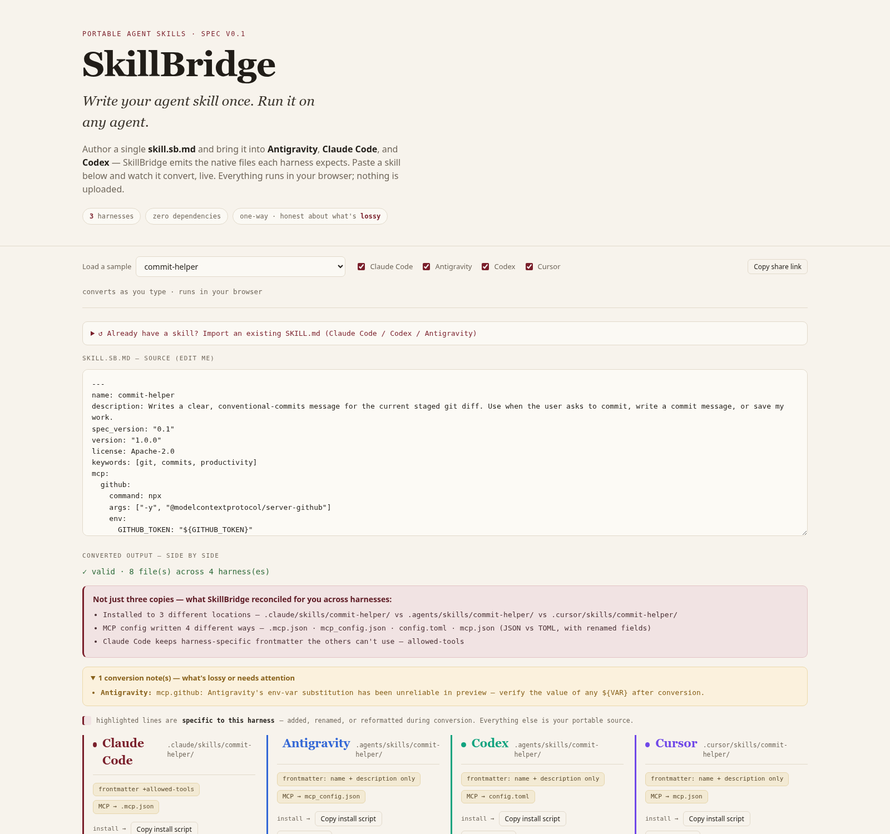

# SkillBridge

**Write your agent skill once. Run it on any agent.**

&nbsp;·&nbsp; **[Blog →](https://substack.com/home/post/p-202889236)** &nbsp;·&nbsp; 

[](https://www.npmjs.com/package/@avee1234/skillbridge)
&nbsp;·&nbsp; **[Live playground →](https://skill-bridge-playground.space)**
&nbsp;·&nbsp; `npx @avee1234/skillbridge convert ./my-skill --to all`


I use several AI coding agents in a normal week. They've all converged on the same good
idea — **skills**, little markdown files that teach an agent a task you repeat all the time.
The idea is the same everywhere. The files are not: each harness wants the skill in its own
directory, with its own frontmatter, its own way of declaring tools and MCP servers, its own
sub-agent format. So every skill I actually liked, I ended up hand-porting to the next tool.

**SkillBridge** is a portable skill format plus a converter. You write one `skill.sb.md`, and
it emits the native files each harness expects — for **Claude Code**, **Codex**, **Cursor**,
and more. Bringing a skill *into* a new agent should be one command, not a rewrite.



## The honest version of "write once, run everywhere"

Here's the thing up front, because it's the whole design: for a simple, instruction-only
skill, the outputs look *almost identical*. That's not a weakness — it's the reason
portability is possible at all. The ecosystem has converged on a shared shape (the open
[Agent Skills](https://agentskills.io) standard: a `SKILL.md` with `name` + `description` +
a markdown body). A skill that uses only that core converts **losslessly** everywhere.
SkillBridge is a thin, strict superset of it.

The work SkillBridge actually does is the rest — the parts that are easy to get wrong by hand:

- **Where the skill installs.** `.claude/skills/` vs `.agents/skills/` vs `.cursor/skills/`.
- **MCP servers, several ways.** A plain `mcpServers` JSON; the same JSON with a renamed
  field; a `[mcp_servers.*]` TOML block; a no-`type` variant.
- **Sub-agents.** A first-class file in most harnesses — and *runtime-only* in one, where the
  honest move is a setup note, not a file the harness won't load.
- **Tool permissions, hooks, arguments.** A different home in every tool.

And the rule behind all of it: **every field a target can't represent is reported as a
warning — never dropped silently.** A fuzz suite, golden snapshots, and a conformance check
stand behind that claim; the parser fails loud rather than ever emitting something subtly wrong.

## Try it

- **Playground** (no install): **[skill-bridge-playground.space](https://skill-bridge-playground.space)** —
  paste/edit a skill and watch it convert live across every harness, side by side, in your
  browser. A summary panel calls out what genuinely differs, a compatibility badge shows
  lossless vs. lossy per target, and a diff toggle shows exactly what changed. Nothing is uploaded.
- **CLI** — on npm as [`@avee1234/skillbridge`](https://www.npmjs.com/package/@avee1234/skillbridge):

```bash
npx @avee1234/skillbridge convert ./my-skill --to all      # one-shot, no install
# or install once:
npm install -g @avee1234/skillbridge                        # then run as `skillbridge`

skillbridge convert ./examples/commit-helper --to all --out ./build
skillbridge import ./.claude/skills/foo/SKILL.md --mcp ./.mcp.json --out ./foo/skill.sb.md
skillbridge init && skillbridge sync --watch                # config-driven, keep targets in sync
skillbridge check          # CI drift gate     skillbridge adopt . --out ./adopted
skillbridge doctor ./my-skill --fix            skillbridge badge ./my-skill --out badge.svg
```

## The format

A skill is a directory with one required file, `skill.sb.md` = YAML frontmatter +
markdown body, plus optional `scripts/` · `references/` · `assets/`.

```markdown
---
name: commit-helper
description: Writes a conventional-commits message for the staged diff. Use when the user asks to commit.
mcp:
  github:
    command: npx
    args: ["-y", "@modelcontextprotocol/server-github"]
    env: { GITHUB_TOKEN: "${GITHUB_TOKEN}" }
targets:
  claude-code:
    frontmatter:
      allowed-tools: "Bash(git diff*), Bash(git log*)"
---

# Commit Helper
1. Read the staged diff…
```

Only `name` + `description` are required. A skill using just those converts losslessly
everywhere. Everything else (`tools`, `mcp`, `targets`) is optional enrichment, emitted
best-effort with a warning whenever a target can't represent it. Full reference:
[`docs/spec.md`](docs/spec.md) · editor schema: [`docs/skill.sb.schema.json`](docs/skill.sb.schema.json).

## What each harness gets

| Harness | Skill file | MCP config |
|---------|-----------|------------|
| Claude Code | `.claude/skills/<name>/SKILL.md` | `.mcp.json` (JSON, `type` field) |
| Antigravity | `.agents/skills/<name>/SKILL.md` | `mcp_config.json` (JSON, `serverUrl`) |
| Codex | `.agents/skills/<name>/SKILL.md` | `config.toml` (`[mcp_servers.*]`, TOML) |
| Cursor | `.cursor/skills/<name>/SKILL.md` | `.cursor/mcp.json` (JSON, no `type`) |

The instruction bodies look similar across harnesses **on purpose** — that convergence is
why portability is possible. The work SkillBridge does is the rest: placing files in
different locations and reconciling each harness's MCP encoding, tool-permission model, and
harness-specific frontmatter that are easy to get wrong by hand. The ground-truth
field-by-field comparison is in [`docs/harness-formats.md`](docs/harness-formats.md).

## Registry

[`registry/`](registry/) is a catalog of ready-to-run skills authored in SkillBridge
format, each verified to convert across every harness. Convert one with
`skillbridge convert registry/<name> --to <harness>`.

## Develop

```bash
cd packages/cli
npm install
npm test            # build + node:test (incl. golden snapshot + round-trip)
npm run build:web   # compile the browser bundle + embed the registry into web/
```

## Honest about scope

- **Sub-agents are supported** as sibling `agents/<name>.sb.md` files, emitted per-harness:
  native files for Claude Code (`.md`), Codex (`.toml`), and Cursor (`.md`); one harness is
  runtime-only, so it gets a documented setup note instead of a fabricated file (lossy, and
  flagged as such). Same honesty applies to tool-permissions, hooks, and args.
- Conversion is **one-way** for now; importing native files back into SkillBridge covers
  `SKILL.md` + MCP config + agent files (`import` / `adopt`), with round-trip tests.
- Formats drift — some harnesses especially (preview-era). The spec is versioned and
  re-verified per release; a fuzz suite + golden snapshots + conformance check guard it.

## License

[Apache-2.0](LICENSE).
